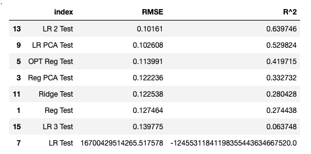

# Grocery Store Sales Precictions

# Objective
## Build and find the most optimal Machine Learning model to predict future sales for Big Mart.

**Author**: 
Darlene Phan

### Business problem:

A small grocery store chain operating locations between 1985 - 2009 are seeking future sales predictions.

### Data
- Source: 
    - https://datahack.analyticsvidhya.com/contest/practice-problem-big-mart-sales-iii/
#### Data Dictionary:
| Variable Name      | Description                                                                                       |
| ------------------ | ------------------------------------------------------------------------------------------------- |
| item_id            | Unique prodcut ID                                                                                 |
| item_weight        | Weight of product                                                                                 |
| item_fat_content   | Whether the product is low fat or regular                                                         |
| item_visibility    | The percentage of total display area of all products in a store allocated to a particular product |
| item_type          | The category to which the product belongs                                                         |
| mrp                | Maximum Retail Price (list price) of the product                                                  |
| outlet_id          | Unique store ID                                                                                   |
| est_year           | The year in which store was established                                                           |
| outlet_size        | The size of the store in terms of ground area covered                                             |
| loc_type           | The type of area in which the store is located                                                    |
| outlet_type        | Whether the outlet is a grocery store or some sort of supermarket                                 |
| item_sales         | Sales of the product in the particular store. This is the target variable to be predicted.        |

#### **Target:**
- Item Sales    
#### **Features:**
   - Item Fat Content
   - Item Visibility
   - Item Type
   - MRP
   - Location Type
   - Outlet Type

## Methods
- The columns that had missing data accounted between 17% - 28% within their respective columns. These columns were dropped, since they could not contribute much in predicting the item sales. 
- Columns within the features matrix were either categorical or numerical. After addressing inconsistencies within the categorical columns they were processed using OneHotEncoder to prep for machine learning. Numerical data was scaled. 
- Visualizations were used for data exploration to identify any correlation (if any) between variables, recognize outliers, display under performing stores, overall item sales, and item sale distribution. 
- 2 Machine Learning models to identify most optimal item sales projections
    -   Regresssion Tree
    -   Linear Regression
## Results

### Data Exploration Visualizations

> This histogram displays the of Sales Distribution by Outlet type. It allows us to visually compare the sales of the outlet types to the overall sales. 

> This bar chart clearly displays the lowest to highest sale items grouped by product type. This allows us to understand what makes up the majority of our sales and places a magnifying glass on the areas that do not perform as well. 

## Model

### Hypertuning Regression Tree

> The final model is a regression tree. Tree based models have a tendency to overfit(high variance) to the training data. This will result in underfitting(high bias) on the testing data. Therefore, in order to create a model that will better predict on new data, we would have to tune the model. Essentially finding the sweet spot that has both a low variance and a low bias. 

> This visual is after automating the depth ranges of the regression tree model in order to find the most optimal depth. It exhibits that depth five will give us the best R^2 test result. We will be modifying the next regression model based on this result. 

## Evaluation:

-   Once both Linear Regression and Regression Tree models were run, the metrics used to determine their accuracy and realtionship were Root Squared Mean Error (RMSE) and R-Squared (R^2)

-   Based on the regression metrics of both models, it's clear that once we addressed the overfitting issue on the Decision Tree training data, the model performed better by roughtly 45%.

-   The implementation of both these models suggest that with some tuning, the Regression Tree performed slightly better than the linear regression model. The R^2 on the Regression Tree suggests that 59% of the target can be realted back to our features data.

-   In conclusion, out of the two machine learning models created, the Regression Tree would be the more ideal choice in this scenario.

## Recommendations:

As a veteran of the Hospitality and Food Service industry, based on my experience, I would recommend an additional analysis on the business. In order to do this, it woul require more detailed data from the individual store to understand those key points. 

Since the R^2 score of both models sit below 59%, it tells us that less than 59% of the target predictions(sales) can be explained by our features matrix. 

## Limitations & Next Steps

-   Based on the dataset given, there are massive limitations to determine growth within the business. 
- These would be my next steps in terms of more data collection:
    -   Monthly or quarterly sales data
    -   Customer purchasing data (Customer averages)
    -   Locations of stores. City or suburb? Are they highly densely populated areas?
    -   Peek Hours of operations
    
-   Questions to consider when determining data collection:
    -   Who are my potential customers?
    -   Who are my competitors?       
    -   What are my lowest performing items? Why?
    -   What are my customers asking for?

In summary, there is a lot more we could explore here. A thing to note, just because two of the stores (Out 19 and Out 10) had lower sales, doesn't necessarily mean they performed poorly. If there was more data, it could potentially show that these stores are performing well. 

Maybe these two locations are not in highly populated areas but perform higher than the competition. They have less customers, smaller store and have higher customer sales average. 

### For further information

For any additional questions, please contact **thelemoncookie.data@gmail.com**
