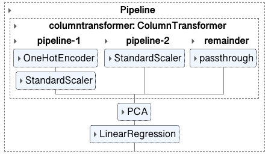

# Red Wine Quality Predictions

                                       

                                

# Objective
## Build a machine learning model to predict the quality of wines based on rating.

**Author**: 
Darlene Phan

### Business problem:

A global wine supplier is looking for a way to rate wines before determining if they should be acquired for their inventory.

### Data
- Source: 
    - https://www.kaggle.com/datasets/fedesoriano/spanish-wine-quality-dataset
#### Data Dictionary:
| Col Name           | Description                                                                                       |
| ------------------ | ------------------------------------------------------------------------------------------------- |
| winery             | Winery Name                                                                                       |
| wine               | Name of Wine                                                                                      |
| year               | Year in which the grapes were harvested                                                           |
| rating             | Average rating given to the wine by the users from 1-5                                            |
| num_reviews        | Number of users that reviewed the wine                                                            |
| country            | Country of origin (Spain)                                                                         |
| region             | Region of the wine                                                                                |
| price              | Price in Euros                                                                                    |
| type               | Wine variety                                                                                      |
| body               | Body score, defined as the richness and weight of the wine in your mouth from 1-5                 |
| acidity            | Acidity score, defined as wine's "pucker" or tartness; it's what makes a wine refreshing and your tongue salivate and want another sip. from 1-5                                 |

#### **Target:**
- Rating    
#### **Features:**
   - Winery
   - Wine
   - Year
   - Num Reviews
   - Region
   - Price
   - Type
   - Body
   - Acidity

## Methods
- Data was only imputed for visualizations.
- Both univariate and multivariate visualizations were used to determine outliers, distribution and patterns.
- Pipelines and column transformers were used to preprocess both the numerical and categorical data for the respective machine learning models.
- Machine Learning Models/Technique used:
    - Linear Regression
    - Principal Component Analysis (PCA)
    - Decision Trees (Regression Trees)
    - Ridge Regression
    - GridSearchCV
    - Feature Engineering
    

## Before We Dig In...

This next scatterplot will shatter your unconscious bias about wine.

> "But Darlene, I don't have any biases when it comes to wine."
> 
Oh, but you do. Contrary to popular belief, more expensive does not mean more better. Nor does it mean that older wines == higher price tags. It is very important to note that, although this is funny, there is an article I came across LinkedIn that talks about how our unconcious bias is hindering the growth of Data Science. (linked below)

[Unconscious Bias is Holding Data Science Back. By: Kate Minogue](https://www.linkedin.com/pulse/unconscious-bias-holding-data-science-back-kate-minogue/)

## Results
### Data Exploration Visualizations
 

> This scatter plot is a visible indicator that regardless of rating, wines can still be priced similarly. We could even theorize that wine ratings have little effect on how wines are priced.

> Due to the unconcious bias surrounding the cost of a wine equating to its age, I've changed the wine year label to 'Vintage'. The four most expensive wine vintages are between 2005-2015. The vintage that is over 100 years old is 1/3rd the price of the top 4 priced wines. There are many factors to why a wine could be priced higher and a lot relies heavily on demand, oak and harvest. I project that due to Covid19 labor shortages since 2020, wine vintages between 2020-2023 will be priced higher than average.  
> [Inflation is driving wine prices higher](https://www.afr.com/policy/economy/inflation-is-driving-wine-prices-higher-20220428-p5ah0l#:~:text=In%20addition%20to%20the%20cost,put%20intense%20pressure%20on%20prices.)

> These bar charts exhibit a trend that majority of Spanish wines have higher acidity levels(great for cutting through fatty foods). Along with medium-full body (will hold up against food) and natrually very good mean rating between 4.3 - 4.7. Most wines are enjoyed with food. Since Spanish wines have characteristics that allow them to stand up to food and not be washed out, it's understandable why the majority of these ratings are as high as they are. 

> This next figure allows us to see the interrelationship between the wine ratings and how heavily rated they are by customers. For example, both 4.2 and 4.3 rated wines have similar customer reviews. However, 4.2 rated wines have 2/3rds less wines than 4.3. Which leads me to believe that the accuracy on 4.2 wines is much higher. 

## Model

### Model Recommendation:Linear Regression 2 Model

## How was the model built?
- Model used PCA with n_components set to .95
- Feature Engineering combining 2 features into a new column
- Filtered categorical column with the most unique values and only keeping rows that had >= 13 data points
- Pipeline for OneHot Encoding Categorical data and Standard Scaler on all data
- Did not impute any missing data

## Evaluation:

According to our test results the Linear Regression 2 Model had the lower RMSE scores without being overfit to the data. The two models with the best R^2 also had training data that was close in range. I think this is a good indicator that both models were well fitted to the training and the testing data.   

#### Additional Exploration
Due to the magnitude of unique categorical values in multiple columns, the first Linear Regression model was increidbly overfit on the training data. Because of this, PCA was able to tremedously improve the model on the testing data by colossal amount. Twelve octillion to be exact.  

<b>Additional methods to combat large unique categorical values:</b>
>
>- <b>Ridge Model:</b> Dropping the largest categorical column
    - Result: Performance was on par with default Regression Tree Model
>- <b>Linear Regression 3:</b> Dropping all columns with large unique values
    - Result: Performed the worst, with the exception of the hugely underfit default Linear Regression Model

## Recommendations, Limitations & Next Steps:
 - Moving onward I would recommend we speak to the client to determine their goals along with how flexible their priorities are. 
 - Communicate with a domain expert to nail down what other data could be gathered to further improve the model. 
 - Their expertise would help aid data scientist in properly identifying the target, filtering/data cleaning, feature selection and even picking machine learning models. 

In summary, I think this dataset is a good example of collecting too much and not enough data at the same time. 

### For further information

For any additional questions, please contact **thelemoncookie.data@gmail.com**
